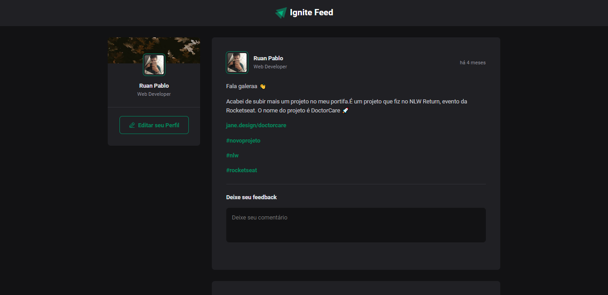

# igfeed

Social media with react js

## Capa

 <br/> <br/>

## Funcionalidades da aplicação
- Listagem de posts
- Adicionar comentários

## Stack

- React
- Typescript
- date-fns
- phosphor-react
- Vite

### Instalação
1. Clone o repositório
```bash
git clone https://github.com/FixRuan/igfeed
```
2. Acesse a pasta do projeto
```bash
cd igfeed
```
3. Instale as dependências necessárias 
```bash
yarn
```
4. Execute o projeto
```bash
yarn start
```
